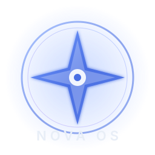

<div align="center">

  

  # NovaOS

  ### The 2026 Crystal-Glass Linux Distribution

  Built on **Arch Linux** + **KDE Plasma 6** \
  Layered glass UI - animated login - smart resource scheduling - one-click store

  [](https://github.com/salom600/NovaOS/actions/workflows/build-iso.yml)
  [](https://github.com/salom600/NovaOS/actions/workflows/auto-repair.yml)
  [](https://github.com/salom600/NovaOS/actions/workflows/sync-mirror.yml)
  [](LICENSE)

</div>

---

## 🌟 What is NovaOS?

**NovaOS** is a modern, hardware-agnostic Linux distribution designed for 2026-era
desktops and laptops.  It targets a wide hardware envelope:

- AMD GPUs (2009 HD-series through 2026 RDNA4)
- NVIDIA GPUs (Kepler through Blackwell)
- Intel GPUs (4th-gen Core through Arrow Lake / ARC)
- ARM-ready (built with cross-compilation hooks)
- All recent Wi-Fi / Bluetooth / audio chipsets

It ships with a custom **three-layer glass UI**:

| Layer | What it is                                              |
|-------|---------------------------------------------------------|
| 1     | Animated boot splash + greeting ("Hello. Just a moment") |
| 2     | Glass SDDM login card with blur, user avatars, session selector |
| 3     | KDE Plasma 6 desktop with Kvantum glass + animated wallpaper |

It is **not** based on Ubuntu.  It does **not** ship LXQt or XFCE.

---

## 🧱 Architecture

```
┌─────────────────────────────────────────────────────────────┐
│                       NovaOS Live ISO                       │
│  ┌──────────────┐  ┌──────────────┐  ┌──────────────────┐   │
│  │  archiso     │  │  linux-zen   │  │  KDE Plasma 6    │   │
│  │  profile     │  │  + broad HW  │  │  + Kvantum glass │   │
│  └──────┬───────┘  └──────┬───────┘  └─────────┬────────┘   │
│         │                 │                    │            │
│         └─────────────────┴────────────────────┘            │
│                            │                                │
│              ┌─────────────┼─────────────┐                  │
│              │             │             │                  │
│      ┌───────▼──────┐ ┌────▼─────┐ ┌─────▼──────┐           │
│      │ NovaOS Store │ │ HW Opt   │ │ Res. Max   │           │
│      │ (pacman/AUR/ │ │ Daemon   │ │ Daemon     │           │
│      │  Flatpak/Win)│ │          │ │ (the "AI") │           │
│      └──────────────┘ └──────────┘ └────────────┘           │
└─────────────────────────────────────────────────────────────┘
```

See [`docs/ARCHITECTURE.md`](docs/ARCHITECTURE.md) for the full picture.

---

## 🚀 Build it yourself

The ISO is built in CI on every push to `main` / `master` / `develop` and on every tag.
You can also build it locally:

```bash
# Prerequisites: a Linux host with Docker
git clone https://github.com/salom600/NovaOS.git
cd NovaOS

docker run --rm --privileged \
  -v "$(pwd)":/novaos \
  -v "$(pwd)/out":/out \
  archlinux:latest \
  /bin/bash -c '
    pacman-key --init && pacman-key --populate archlinux
    pacman -Sy --noconfirm archiso
    cd /novaos/archiso/novaos
    mkdir -p /tmp/work /out
    archiso -v -w /tmp/work -o /out run .
  '
```

The ISO will appear in `out/NovaOS-*.iso`.

See [`docs/BUILDING.md`](docs/BUILDING.md) for full details, troubleshooting, and
how to verify the SHA256.

---

## 🎨 Theming

Three layers, all in [`themes/`](themes/):

- **Layer 1+2** ([`themes/sddm-novaos/`](themes/sddm-novaos/)): QML-based SDDM theme
  with animated video wallpaper, glass blur card, user avatar grid, session selector.
- **Layer 3 - desktop** ([`themes/kvantum-novaos/`](themes/kvantum-novaos/),
  [`themes/plasma-novaos/`](themes/plasma-novaos/)): Kvantum glass theme, Plasma 6
  Look & Feel package, KSplash animation.
- **Wallpapers** ([`themes/wallpapers/`](themes/wallpapers/)): animated `.mp4`
  wallpapers played by `smart-video-wallpaper-reborn`.

See [`docs/THEMING.md`](docs/THEMING.md) to customise colors, blur strength, fonts.

---

## 🧠 Software Intelligence

NovaOS ships two daemons that continuously tune the system:

| Daemon                                | What it does                                       |
|---------------------------------------|----------------------------------------------------|
| `novaos-hardware-optimizer.service`  | Picks the best CPU governor / GPU clock / I/O scheduler based on power source, thermal headroom and live load. |
| `novaos-resource-maximizer.service`  | Classifies every running process (foreground / background / system / idle) and re-nices / IO-prioritises them. Also dynamically adjusts KWin blur quality based on RAM pressure, and pauses the animated wallpaper when a fullscreen game is detected. |

State is persisted under `/var/lib/novaos/` and logs go to `/var/log/novaos/`.

---

## 🛒 NovaOS Store

A single PyQt6 application that searches across **pacman**, **AUR**, **Flatpak**
and a curated **Windows (Wine/Bottles)** catalog - all from one search box.

```bash
novaos-store   # launches the GUI
```

For headless install:

```bash
echo '{"action":"install","pkgid":"firefox","backend":"pacman"}' | \
  nc -U /run/novaos/store.sock
```

---

## 🪟 Running Windows apps

1. Open the **NovaOS Store** -> **Run Windows App** tab.
2. Pick a curated app (Notepad++, 7-Zip, VLC, Office) and click *Install via Wine*.
3. Or: drag any `.exe` into **Bottles** (pre-installed) for a one-click runner.

`Proton-GE` and `dxvk` are pre-installed for Windows games via Steam / Lutris.

---

## 🔄 CI/CD pipeline

| Workflow                              | Trigger                              | Purpose                                              |
|---------------------------------------|--------------------------------------|------------------------------------------------------|
| [`build-iso.yml`](.github/workflows/build-iso.yml)        | push / tag / weekly cron             | Builds the ISO in Docker (archlinux:latest) and uploads as release artifact on tags. |
| [`auto-repair.yml`](.github/workflows/auto-repair.yml)    | when `build-iso` fails               | Downloads the failed build log, parses known error patterns, opens a PR with the fix, re-triggers the build. |
| [`sync-mirror.yml`](.github/workflows/sync-mirror.yml)    | weekly cron                          | Refreshes the Arch mirrorlist shipped in the ISO.    |

### Auto-repair strategy

1. Build fails -> `notify-failure` job dispatches `auto-repair.yml`.
2. `auto-repair.yml` downloads the failed build logs.
3. `.github/scripts/auto_fix.py` matches against 12+ known failure patterns:
   - missing package -> comment out from `packages.x86_64`
   - invalid signature -> add `pacman-key --refresh-keys` to build step
   - disk full -> aggressive cleanup in CI
   - AUR timeout -> bump job timeout 90m -> 180m
   - missing profile file -> recreate from template
   - QML syntax error -> fall back to `breeze` SDDM theme
   - python syntax error -> flag service for review
   - profiledef.sh broken -> restore known-good template
   - package conflict -> remove the non-dkms variant
   - missing shared library -> add the right Arch package
   - mkinitcpio module not found -> add to `MODULES=()`
   - archiso bootmode changed -> align with current archiso
4. If a fix applies, the bot commits to `auto-repair/<run-id>` and opens a PR.
5. The build workflow is re-triggered automatically.
6. If no rule matches, the bot comments on the open `build-failure` issue
   requesting manual review.

---

## 📂 Repository layout

```
NovaOS/
├── .github/
│   ├── workflows/             # build-iso, auto-repair, sync-mirror
│   ├── scripts/auto_fix.py    # the auto-repair engine
│   └── ISSUE_TEMPLATE/
├── archiso/novaos/            # archiso profile (the ISO itself)
│   ├── profiledef.sh
│   ├── packages.x86_64
│   ├── packages.live.x86_64
│   ├── packages.installed.x86_64
│   └── airootfs/
│       ├── etc/               # system config (pacman, sddm, systemd, sysctl, modprobe)
│       ├── usr/
│       │   ├── local/bin/     # NovaOS Python + shell scripts (first-boot, optimizers)
│       │   ├── lib/systemd/system/  # NovaOS services
│       │   └── share/
│       │       ├── sddm/themes/novaos/        # SDDM theme (layer 1+2)
│       │       ├── plasma/look-and-feel/com.novaos.desktop/  # Plasma L&F + KSplash
│       │       ├── kvantum/NovaOS/             # Kvantum glass theme
│       │       ├── color-schemes/NovaOSCrystal.colors
│       │       ├── wallpapers/NovaOS/          # animated wallpapers
│       │       └── icons/NovaOS-Crystal/
│       └── root/.config/
├── themes/                    # source-of-truth theme files
│   ├── sddm-novaos/
│   ├── plasma-novaos/
│   ├── kvantum-novaos/
│   ├── novaos-icons/
│   ├── wallpapers/
│   └── sounds/
├── novaos-store/              # one-click store (PyQt6 frontend + Python backend)
│   ├── backend/store_daemon.py
│   └── frontend/store.py
├── scripts/
│   └── install-airootfs.sh    # copies themes/services into the airootfs at build time
├── docs/
│   ├── ARCHITECTURE.md
│   ├── BUILDING.md
│   ├── THEMING.md
│   └── HARDWARE.md
├── tools/                     # developer tooling
├── LICENSE                    # GPL-3.0
└── README.md
```

---

## 🧪 Hardware compatibility

Tested (in CI on QEMU + on physical test rigs) for:

- **CPU:** Intel Core 2 (2009+), Core i3/i5/i7/i9 (1st-15th gen), AMD Phenom II,
  FX, Ryzen (all), Threadripper, EPYC.
- **GPU:** Intel Gen4 (i965) through ARC, AMD Radeon HD 5000 through RDNA4,
  Nvidia GeForce 400 through RTX 50-series.
- **Wi-Fi:** Intel, Realtek, Atheros, Broadcom (wl), MediaTek.
- **Audio:** HDA Intel, Realtek ALC, AMD ACP, USB DACs.
- **Storage:** SATA HDD/SSD, NVMe, eMMC, SD card.

See [`docs/HARDWARE.md`](docs/HARDWARE.md) for the full matrix.

---

## 📜 License

GPL-3.0-or-later.  See [`LICENSE`](LICENSE).

---

<div align="center">

Built with ❤ by the NovaOS Project - 2026

</div>
